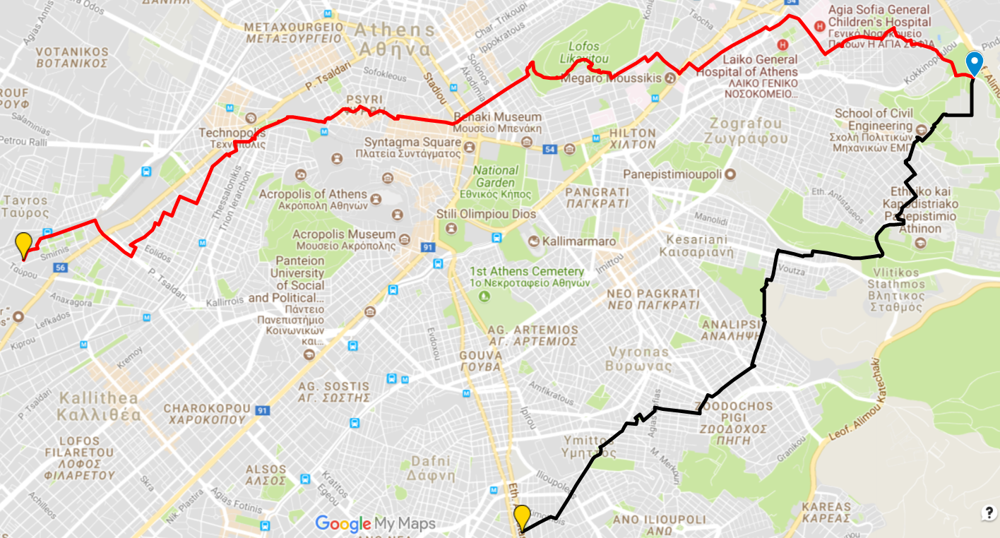
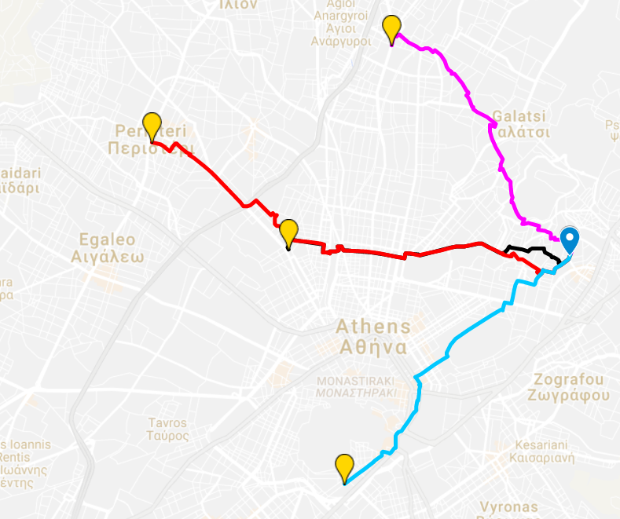

# gps
A GPS tracking system as a taxi-service for the course of Artificial Intelligence. It is implemented in Java and uses A*. Haversine Distance metric is used. Traffic, highways, speed limits, etc are modeled and `PROLOG` is used to make decisions.
Contributors: [Dimitriadis Nikos](https://github.com/nik-dim)  &&  [Tsiourvas Asterios](http://github.com/asterios-tsiourvas)

## Sample outputs

